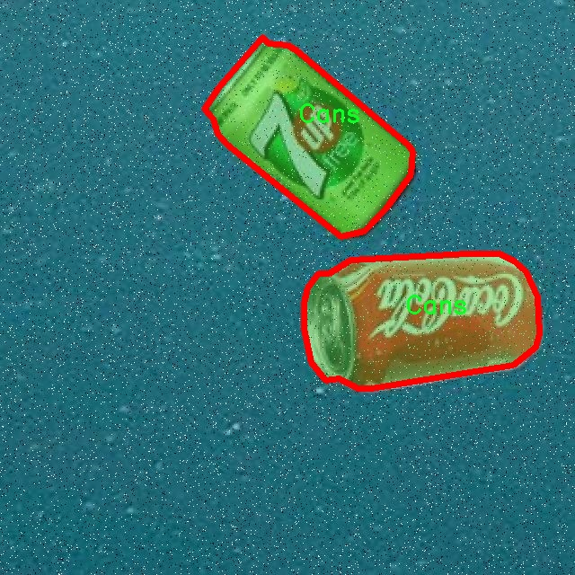

# 罐头图像分割系统源码＆数据集分享
 [yolov8-seg-vanillanet＆yolov8-seg-SPPF-LSKA等50+全套改进创新点发刊_一键训练教程_Web前端展示]

### 1.研究背景与意义

项目参考[ILSVRC ImageNet Large Scale Visual Recognition Challenge](https://gitee.com/YOLOv8_YOLOv11_Segmentation_Studio/projects)

项目来源[AAAI Global Al lnnovation Contest](https://kdocs.cn/l/cszuIiCKVNis)

研究背景与意义

随着计算机视觉技术的迅猛发展，图像分割作为其中一个重要的研究方向，受到了广泛的关注。图像分割的目标是将图像划分为多个有意义的区域，以便于后续的分析和处理。在众多图像分割方法中，基于深度学习的实例分割技术逐渐成为研究的热点。尤其是YOLO（You Only Look Once）系列模型，以其高效的实时检测能力和良好的准确性，广泛应用于目标检测和分割任务中。YOLOv8作为该系列的最新版本，进一步提升了模型的性能和适用性，为复杂场景下的图像分割提供了新的解决方案。

在工业自动化和智能制造领域，罐头产品的自动识别与分割显得尤为重要。罐头作为一种常见的食品包装形式，其在生产、运输和销售环节中都需要进行有效的识别与分类。传统的图像处理方法在面对多样化的罐头形态、光照变化及背景复杂性时，往往难以达到理想的效果。因此，基于深度学习的图像分割技术，尤其是改进后的YOLOv8模型，能够通过对罐头图像进行精准的实例分割，显著提高识别的准确性和效率。

本研究将构建一个基于改进YOLOv8的罐头图像分割系统，旨在解决当前罐头图像处理中的一些关键问题。首先，研究将使用包含3000张罐头图像的数据集，进行模型的训练和验证。该数据集专注于单一类别的罐头图像，使得模型能够在特定领域内进行深度学习，从而提升分割精度。其次，针对YOLOv8模型的特性，研究将探索改进策略，以适应罐头图像的特征，提升模型在实例分割任务中的表现。

本研究的意义不仅在于提升罐头图像的分割精度，更在于推动计算机视觉技术在食品工业中的应用。通过高效的图像分割系统，可以实现对罐头产品的自动化识别与分类，降低人工成本，提高生产效率。此外，研究成果也可为其他相似领域的图像处理提供借鉴，推动深度学习技术在更多行业的应用。

综上所述，基于改进YOLOv8的罐头图像分割系统的研究，不仅具有重要的理论价值，也具备广泛的实际应用前景。通过深入探讨该系统的构建与优化，期望能够为罐头产品的智能识别与分类提供新的思路与方法，助力食品工业的智能化转型与升级。

### 2.图片演示


##### 注意：由于此博客编辑较早，上面“2.图片演示”和“3.视频演示”展示的系统图片或者视频可能为老版本，新版本在老版本的基础上升级如下：（实际效果以升级的新版本为准）

  （1）适配了YOLOV8的“目标检测”模型和“实例分割”模型，通过加载相应的权重（.pt）文件即可自适应加载模型。

  （2）支持“图片识别”、“视频识别”、“摄像头实时识别”三种识别模式。

  （3）支持“图片识别”、“视频识别”、“摄像头实时识别”三种识别结果保存导出，解决手动导出（容易卡顿出现爆内存）存在的问题，识别完自动保存结果并导出到tempDir中。

  （4）支持Web前端系统中的标题、背景图等自定义修改，后面提供修改教程。

  另外本项目提供训练的数据集和训练教程,暂不提供权重文件（best.pt）,需要您按照教程进行训练后实现图片演示和Web前端界面演示的效果。

### 3.视频演示

[3.1 视频演示](https://www.bilibili.com/video/BV1SgDHYVEUW/)

### 4.数据集信息展示

##### 4.1 本项目数据集详细数据（类别数＆类别名）

nc: 1
names: ['Cans']


##### 4.2 本项目数据集信息介绍

数据集信息展示

在本研究中，我们使用的数据集名为“asd”，该数据集专门用于训练和改进YOLOv8-seg模型，以实现高效的罐头图像分割系统。该数据集的设计旨在满足现代计算机视觉任务的需求，尤其是在目标检测和图像分割领域。通过精心收集和标注的图像数据，数据集“asd”提供了一个良好的基础，以帮助模型在复杂的视觉环境中识别和分割目标。

数据集“asd”包含一个类别，具体为“Cans”。这一类别的选择不仅反映了我们研究的重点，也突显了罐头产品在日常生活中的普遍性。罐头食品因其便捷性和长保质期而受到广泛欢迎，因此，准确地识别和分割罐头图像对于自动化食品处理、智能零售和仓储管理等应用场景具有重要意义。数据集中的图像涵盖了多种不同类型的罐头，包括但不限于蔬菜罐头、肉类罐头和水果罐头等，确保了模型在不同场景下的泛化能力。

在数据集的构建过程中，我们注重多样性和代表性，确保所收集的图像能够反映出罐头在实际应用中的各种可能性。图像的拍摄环境多样，包括不同的光照条件、背景复杂度和角度变化，这样的设计旨在提高模型在真实世界中应用的鲁棒性。此外，数据集中的每一张图像都经过了严格的标注，确保了罐头目标的边界框和分割掩码的准确性。这种高质量的标注对于训练深度学习模型至关重要，因为它直接影响到模型的学习效果和最终性能。

在数据集“asd”的使用过程中，我们将采用YOLOv8-seg模型进行训练。YOLOv8-seg作为一种先进的目标检测与分割模型，具备高效的实时处理能力和优越的精度表现。通过对数据集的充分利用，我们期望模型能够在罐头图像分割任务中实现显著的性能提升。具体而言，我们将通过不断调整模型参数、优化训练策略以及进行数据增强等手段，来提高模型对罐头目标的识别率和分割精度。

值得一提的是，数据集“asd”的构建不仅是为了单一的研究目的，更是为未来相关领域的研究提供了基础数据支持。随着深度学习技术的不断发展，罐头图像分割的应用前景将更加广阔。我们相信，通过对数据集的深入研究和模型的不断优化，能够推动罐头图像分割技术的进步，并为相关行业的智能化发展贡献力量。

总之，数据集“asd”在本研究中扮演着至关重要的角色。它不仅为YOLOv8-seg模型的训练提供了必要的数据支持，也为未来的研究和应用奠定了基础。通过对罐头图像的精确分割，我们希望能够在实际应用中实现更高效的自动化处理，进而推动相关领域的技术进步和产业发展。





### 5.全套项目环境部署视频教程（零基础手把手教学）

[5.1 环境部署教程链接（零基础手把手教学）](https://www.bilibili.com/video/BV1jG4Ve4E9t/?vd_source=bc9aec86d164b67a7004b996143742dc)


[5.2 安装Python虚拟环境创建和依赖库安装视频教程链接（零基础手把手教学）](https://www.bilibili.com/video/BV1nA4VeYEze/?vd_source=bc9aec86d164b67a7004b996143742dc)

### 6.手把手YOLOV8-seg训练视频教程（零基础小白有手就能学会）

[6.1 手把手YOLOV8-seg训练视频教程（零基础小白有手就能学会）](https://www.bilibili.com/video/BV1cA4VeYETe/?vd_source=bc9aec86d164b67a7004b996143742dc)


按照上面的训练视频教程链接加载项目提供的数据集，运行train.py即可开始训练



     Epoch   gpu_mem       box       obj       cls    labels  img_size
     1/200     0G   0.01576   0.01955  0.007536        22      1280: 100%|██████████| 849/849 [14:42<00:00,  1.04s/it]
               Class     Images     Labels          P          R     mAP@.5 mAP@.5:.95: 100%|██████████| 213/213 [01:14<00:00,  2.87it/s]
                 all       3395      17314      0.994      0.957      0.0957      0.0843

     Epoch   gpu_mem       box       obj       cls    labels  img_size
     2/200     0G   0.01578   0.01923  0.007006        22      1280: 100%|██████████| 849/849 [14:44<00:00,  1.04s/it]
               Class     Images     Labels          P          R     mAP@.5 mAP@.5:.95: 100%|██████████| 213/213 [01:12<00:00,  2.95it/s]
                 all       3395      17314      0.996      0.956      0.0957      0.0845

     Epoch   gpu_mem       box       obj       cls    labels  img_size
     3/200     0G   0.01561    0.0191  0.006895        27      1280: 100%|██████████| 849/849 [10:56<00:00,  1.29it/s]
               Class     Images     Labels          P          R     mAP@.5 mAP@.5:.95: 100%|███████   | 187/213 [00:52<00:00,  4.04it/s]
                 all       3395      17314      0.996      0.957      0.0957      0.0845


### 7.50+种全套YOLOV8-seg创新点代码加载调参视频教程（一键加载写好的改进模型的配置文件）

[7.1 50+种全套YOLOV8-seg创新点代码加载调参视频教程（一键加载写好的改进模型的配置文件）](https://www.bilibili.com/video/BV1Hw4VePEXv/?vd_source=bc9aec86d164b67a7004b996143742dc)

### 8.YOLOV8-seg图像分割算法原理

原始YOLOv8-seg算法原理

YOLOv8-seg算法是YOLO系列中的一个重要进展，专注于目标检测与分割任务的结合。该算法在YOLOv8的基础上进行了进一步的优化与扩展，旨在提高图像中目标的检测精度与分割效果。YOLOv8-seg的核心理念是通过集成目标检测与语义分割的能力，使得模型不仅能够识别出图像中的目标物体，还能精确地分割出这些目标的边界，从而为后续的图像分析和处理提供更为丰富的信息。

在YOLOv8-seg中，网络结构依然由骨干特征提取网络、特征融合层及检测头层三部分组成，但其在细节上进行了诸多创新。首先，骨干特征提取网络采用了轻量化的C2F模块，这一模块的设计理念是通过减少参数量和计算量来提升模型的运行效率。C2F模块将卷积操作优化为3×3的卷积核，并通过深度可分离卷积来降低计算复杂度。这种设计使得YOLOv8-seg在处理高分辨率图像时，能够保持较高的帧率，适应实时检测的需求。

特征融合层是YOLOv8-seg的另一个关键部分。在这一层中，算法结合了特征金字塔网络（FPN）与路径聚合网络（PAN），以实现多尺度特征的有效融合。FPN通过构建特征金字塔，能够在不同的尺度上提取丰富的特征信息，而PAN则通过路径聚合机制增强了特征的传递效率。YOLOv8-seg在此基础上引入了BiFPN网络，利用双向跨尺度连接和加权特征融合的策略，进一步提升了模型对不同尺度目标的检测能力。这种特征融合策略不仅提高了模型的检测精度，还增强了对复杂场景中目标的分割能力。

在检测头层，YOLOv8-seg采用了轻量化的解耦头结构，替代了传统的耦合头。这一改进使得模型能够在处理目标检测和分割任务时，分别优化分类和定位的损失函数，从而实现更高的检测精度。具体而言，YOLOv8-seg引入了变焦损失（Focal Loss）来处理类别不平衡问题，同时使用数据平均保真度损失和完美交并比损失来优化边界框的回归任务。这种新的损失策略使得模型在面对复杂背景和多样化目标时，能够更准确地进行分类与定位。

YOLOv8-seg还特别关注模型的可扩展性与适应性。通过引入注意力机制，算法能够在特征提取过程中自适应地关注图像中重要的区域，从而提升目标的分割效果。注意力机制的应用使得模型在处理不同类型的目标时，能够动态调整其关注点，增强了模型的灵活性与鲁棒性。此外，YOLOv8-seg还支持多尺度训练与测试，这一策略通过在不同的尺度上进行训练，使得模型能够更好地适应实际应用中的各种场景。

综上所述，YOLOv8-seg算法通过对YOLOv8的多项优化与扩展，成功地将目标检测与分割任务结合在一起。其轻量化的网络结构、有效的特征融合策略、创新的损失函数设计以及灵活的注意力机制，使得YOLOv8-seg在目标检测与分割领域展现出优异的性能。该算法不仅在精度和速度上相较于前代模型有了显著提升，同时也为实际应用提供了更为丰富的信息，适用于智能监控、自动驾驶、医学影像分析等多个领域。通过不断的迭代与优化，YOLOv8-seg无疑将成为目标检测与分割任务中的一项重要工具，推动相关研究与应用的进一步发展。


### 9.系统功能展示（检测对象为举例，实际内容以本项目数据集为准）

图9.1.系统支持检测结果表格显示

  图9.2.系统支持置信度和IOU阈值手动调节

  图9.3.系统支持自定义加载权重文件best.pt(需要你通过步骤5中训练获得)

  图9.4.系统支持摄像头实时识别

  图9.5.系统支持图片识别

  图9.6.系统支持视频识别

  图9.7.系统支持识别结果文件自动保存

  图9.8.系统支持Excel导出检测结果数据


### 10.50+种全套YOLOV8-seg创新点原理讲解（非科班也可以轻松写刊发刊，V11版本正在科研待更新）

#### 10.1 由于篇幅限制，每个创新点的具体原理讲解就不一一展开，具体见下列网址中的创新点对应子项目的技术原理博客网址【Blog】：


[10.1 50+种全套YOLOV8-seg创新点原理讲解链接](https://gitee.com/qunmasj/good)

#### 10.2 部分改进模块原理讲解(完整的改进原理见上图和技术博客链接)【如果此小节的图加载失败可以通过CSDN或者Github搜索该博客的标题访问原始博客，原始博客图片显示正常】
### YOLOv8简介

YOLOv8是一种最新的SOTA算法，提供了N/S/M/L/X尺度的不同大小模型，以满足不同场景的需求。本章对算法网络的新特性进行简要介绍。


1）骨干网络和Neck
开发者设计了C2f模块对CSPDarkNet 53和PAFPN进行改造。相比C3模块，C2f模块拥有更多的分支跨层链接，使模型的梯度流更加丰富，显著增强了模型的特征提取能力。
2)Head部分
Head部分采用无锚框设计，将分类任务和回归任务进行了解耦，独立的分支将更加专注于其所负责的特征信息。
3）损失计算
模型使用CIOU Loss作为误差损失函数，并通过最小化DFL进一步提升边界框的回归精度。同时模型采用了TaskAlignedAssigner样本分配策略，以分类得分和IOU的高阶组合作为指标指导正负样本选择，实现了高分类得分和高IOU的对齐，有效地提升了模型的检测精度。


### D-LKA Attention简介
自2010年代中期以来，卷积神经网络（CNNs）已成为许多计算机视觉应用的首选技术。它们能够从原始数据中自动提取复杂的特征表示，无需手动进行特征工程，这引起了医学图像分析社区的极大兴趣。许多成功的CNN架构，如U-Net、全卷积网络、DeepLab或SegCaps（分割胶囊），已经被开发出来。这些架构在语义分割任务中取得了巨大成功，先前的最新方法已经被超越。

在计算机视觉研究中，不同尺度下的目标识别是一个关键问题。在CNN中，可检测目标的大小与相应网络层的感受野尺寸密切相关。如果一个目标扩展到超出这个感受野的边界，这可能会导致欠分割结果。相反，与目标实际大小相比使用过大的感受野可能会限制识别，因为背景信息可能会对预测产生不必要的影响。

解决这个问题的一个有希望的方法涉及在并行使用具有不同尺寸的多个Kernel，类似于Inception块的机制。然而，由于参数和计算要求的指数增长，将Kernel大小增加以容纳更大的目标在实践中受到限制。因此，出现了各种策略，包括金字塔池化技术和不同尺度的扩张卷积，以捕获多尺度的上下文信息。

另一个直观的概念涉及将多尺度图像金字塔或它们的相关特征表示直接纳入网络架构。然而，这种方法存在挑战，特别是在管理训练和推理时间方面的可行性方面存在挑战。在这个背景下，使用编码器-解码器网络，如U-Net，已被证明是有利的。这样的网络在较浅的层中编码外观和位置，而在更深的层中，通过神经元的更广泛的感受野捕获更高的语义信息和上下文信息。

一些方法将来自不同层的特征组合在一起，或者预测来自不同尺寸的层的特征以使用多尺度的信息。此外，出现了从不同尺度的层中预测特征的方法，有效地实现了跨多个尺度的见解整合。然而，大多数编码器-解码器结构面临一个挑战：它们经常无法在不同尺度之间保持一致的特征，并主要使用最后一个解码器层生成分割结果。

语义分割是一项任务，涉及根据预定义的标签集为图像中的每个像素预测语义类别。这项任务要求提取高级特征同时保留初始的空间分辨率。CNNs非常适合捕获局部细节和低级信息，尽管以忽略全局上下文为代价。视觉Transformer（ViT）架构已经成为解决处理全局信息的视觉任务的关键，包括语义分割，取得了显著的成功。

ViT的基础是注意力机制，它有助于在整个输入序列上聚合信息。这种能力使网络能够合并远程的上下文提示，超越了CNN的有限感受野尺寸。然而，这种策略通常会限制ViT有效建模局部信息的能力。这种局限可能会妨碍它们检测局部纹理的能力，这对于各种诊断和预测任务至关重要。这种缺乏局部表示可以归因于ViT模型处理图像的特定方式。

ViT模型将图像分成一系列Patch，并使用自注意力机制来模拟它们之间的依赖关系。这种方法可能不如CNN模型中的卷积操作对感受野内提取局部特征有效。ViT和CNN模型之间的这种图像处理方法的差异可能解释了CNN模型在局部特征提取方面表现出色的原因。

近年来，已经开发出创新性方法来解决Transformer模型内部局部纹理不足的问题。其中一种方法是通过互补方法将CNN和ViT特征结合起来，以结合它们的优势并减轻局部表示的不足。TransUNet是这种方法的早期示例，它在CNN的瓶颈中集成了Transformer层，以模拟局部和全局依赖关系。HiFormer提出了一种解决方案，将Swin Transformer模块和基于CNN的编码器结合起来，生成两个多尺度特征表示，通过Double-Level Fusion模块集成。UNETR使用基于Transformer的编码器和CNN解码器进行3D医学图像分割。CoTr和TransBTS通过Transformer在低分辨率阶段增强分割性能，将CNN编码器和解码器连接在一起。

增强局部特征表示的另一种策略是重新设计纯Transformer模型内部的自注意力机制。在这方面，Swin-Unet在U形结构中集成了一个具有线性计算复杂性的Swin Transformer块作为多尺度 Backbone 。MISSFormer采用高效Transformer来解决视觉Transformer中的参数问题，通过在输入块上进行不可逆的降采样操作。D-Former引入了一个纯Transformer的管道，具有双重注意模块，以分段的方式捕获细粒度的局部注意和与多元单元的交互。然而，仍然存在一些特定的限制，包括计算效率低下，如TransUNet模型所示，对CNN Backbone 的严重依赖，如HiFormer所观察到的，以及对多尺度信息的忽略。

此外，目前的分割架构通常采用逐层处理3D输入 volumetric 的方法，无意中忽视了相邻切片之间的潜在相关性。这一疏忽限制了对 volumetric 信息的全面利用，因此损害了定位精度和上下文集成。此外，必须认识到，医学领域的病变通常在形状上发生变形。因此，用于医学图像分析的任何学习算法都必须具备捕捉和理解这些变形的能力。与此同时，该算法应保持计算效率，以便处理3D volumetric数据。

为了解决上述提到的挑战，作者提出了一个解决方案，即可变形大卷积核注意力模块（Deformable LKA module），它是作者网络设计的基本构建模块。这个模块明确设计成在有效处理上下文信息的同时保留局部描述符。作者的架构在这两个方面的平衡增强了实现精确语义分割的能力。

值得注意的是，参考该博客引入了一种基于数据的感受野的动态适应，不同于传统卷积操作中的固定滤波器Mask。这种自适应方法使作者能够克服与静态方法相关的固有限制。这种创新方法还扩展到了D-LKA Net架构的2D和3D版本的开发。

在3D模型的情况下，D-LKA机制被量身定制以适应3D环境，从而实现在不同 volumetric 切片之间无缝信息交互。最后，作者的贡献通过其计算效率得到进一步强调。作者通过仅依靠D-LKA概念的设计来实现这一点，在各种分割基准上取得了显著的性能，确立了作者的方法作为一种新的SOTA方法。

在本节中，作者首先概述方法论。首先，作者回顾了由Guo等人引入的大卷积核注意力（Large Kernel Attention，LKA）的概念。然后，作者介绍了作者对可变形LKA模块的创新探索。在此基础上，作者介绍了用于分割任务的2D和3D网络架构。

大卷积核提供了与自注意力机制类似的感受野。可以通过使用深度卷积、深度可扩展卷积和卷积来构建大卷积核，从而减少了参数和计算量。构建输入维度为和通道数的卷积核的深度卷积和深度可扩展卷积的卷积核大小的方程如下：


具有卷积核大小和膨胀率。参数数量和浮点运算（FLOPs）的计算如下：


FLOPs的数量与输入图像的大小成线性增长。参数的数量随通道数和卷积核大小的增加而呈二次增长。然而，由于它们通常都很小，因此它们不是限制因素。

为了最小化对于固定卷积核大小K的参数数量，可以将方程3对于膨胀率的导数设定为零：


例如，当卷积核大小为时，结果是。将这些公式扩展到3D情况是直接的。对于大小为和通道数C的输入，3D情况下参数数量和FLOPs 的方程如下：


具有卷积核大小和膨胀。


利用大卷积核进行医学图像分割的概念通过引入可变形卷积得以扩展。可变形卷积可以通过整数偏移自由调整采样网格以进行自由变形。额外的卷积层从特征图中学习出变形，从而创建一个偏移场。基于特征本身学习变形会导致自适应卷积核。这种灵活的卷积核形状可以提高病变或器官变形的表示，从而增强了目标边界的定义。

负责计算偏移的卷积层遵循其相应卷积层的卷积核大小和膨胀。双线性插值用于计算不在图像网格上的偏移的像素值。如图2所示，D-LKA模块可以表示为：


其中输入特征由表示，。表示为注意力图，其中每个值表示相应特征的相对重要性。运算符  表示逐元素乘法运算。值得注意的是，LKA不同于传统的注意力方法，它不需要额外的规范化函数，如或。这些规范化函数往往忽视高频信息，从而降低了基于自注意力的方法的性能。

在该方法的2D版本中，卷积层被可变形卷积所替代，因为可变形卷积能够改善对具有不规则形状和大小的目标的捕捉能力。这些目标在医学图像数据中常常出现，因此这种增强尤为重要。

然而，将可变形LKA的概念扩展到3D领域会带来一定的挑战。主要的约束来自于需要用于生成偏移的额外卷积层。与2D情况不同，由于输入和输出通道的性质，这一层无法以深度可分的方式执行。在3D环境中，输入通道对应于特征，而输出通道扩展到，其中是卷积核的大小。大卷积核的复杂性导致沿第3D的通道数扩展，导致参数和FLOPs大幅增加。因此，针对3D情况采用了另一种替代方法。在现有的LKA框架中，深度卷积之后引入了一个单独的可变形卷积层。这种战略性的设计调整旨在减轻扩展到3D领域所带来的挑战。


2D网络的架构如图1所示。第一变种使用MaxViT作为编码器组件，用于高效特征提取，而第二变种则结合可变形LKA层进行更精细、卓越的分割。

在更正式的描述中，编码器生成4个分层输出表示。首先，卷积干扰将输入图像的维度减小到。随后，通过4个MaxViT块的4个阶段进行特征提取，每个阶段后跟随降采样层。随着过程进展到解码器，实施了4个阶段的D-LKA层，每个阶段包含2个D-LKA块。然后，应用Patch扩展层以实现分辨率上采样，同时减小通道维度。最后，线性层负责生成最终的输出。

2D D-LKA块的结构包括LayerNorm、可变形LKA和多层感知器（MLP）。积分残差连接确保了有效的特征传播，即使在更深层也是如此。这个安排可以用数学方式表示为：


其中输入特征，层归一化LN，可变形LKA注意力，深度卷积，线性层和GeLU激活函数。

3D网络架构如图1所示，采用编码器-解码器设计进行分层结构化。首先，一个Patch嵌入层将输入图像的维度从（）减小到（）。在编码器中，采用了3个D-LKA阶段的序列，每个阶段包含3个D-LKA块。在每个阶段之后，通过降采样步骤将空间分辨率减半，同时将通道维度加倍。中央瓶颈包括另一组2个D-LKA块。解码器结构与编码器相对称。

为了将特征分辨率加倍，同时减少通道数，使用转置卷积。每个解码器阶段都使用3个D-LKA块来促进远距离特征依赖性。最终的分割输出由一个卷积层产生，后面跟随一个卷积层以匹配特定类别的通道要求。

为了建立输入图像和分割输出之间的直接连接，使用卷积形成了一个跳跃连接。额外的跳跃连接根据简单的加法对来自其他阶段的特征进行融合。最终的分割图是通过和卷积层的组合产生的。

3D D-LKA块包括层归一化，后跟D-LKA注意力，应用了残差连接的部分。随后的部分采用了一个卷积层，后面跟随一个卷积层，两者都伴随着残差连接。这个整个过程可以总结如下：


带有输入特征 、层归一化 、可变形 LKA 、卷积层 和输出特征 的公式。是指一个前馈网络，包括2个卷积层和激活函数。

表7显示了普通卷积和构建卷积的参数数量比较。尽管标准卷积的参数数量在通道数较多时急剧增加，但分解卷积的参数总体较低，并且增长速度不那么快。

与分解卷积相比，可变形分解卷积增加了大量参数，但仍然明显小于标准卷积。可变形卷积的主要参数是由偏移网络创建的。在这里，作者假设可变形深度卷积的Kernel大小为（5,5），可变形深度空洞卷积的Kernel大小为（7,7）。这导致了21×21大小的大Kernel的最佳参数数量。更高效地生成偏移量的方法将大大减少参数数量。


值得注意的是，引入可变形LKA确实会增加模型的参数数量和每秒的浮点运算次数（FLOPS）。然而，重要的是强调，这增加的计算负载不会影响作者模型的整体推理速度。

相反，对于Batch-size > 1，作者甚至观察到推理时间的减少，如图7所示。例如，基于作者的广泛实验，作者观察到对于Batch-size为16，具有可变形卷积和没有可变形卷积的推理时间分别为8.01毫秒和17.38毫秒。作者认为这是由于在2D中对可变形卷积的高效实现所致。为了测量时间，使用了大小为（）的随机输入。在GPU热身周期50次迭代之后，网络被推断了1000次。测量是在NVIDIA RTX 3090 GPU上进行的。


为了充分利用性能与参数之间的权衡关系，作者在图8中可视化了在Synapse 2D数据集上报告的DSC和HD性能以及基于参数数量的内存消耗。D-LKA Net引入了相当多的参数，约为101M。这比性能第二好的方法ScaleFormer使用的111.6M参数要少。

与更轻量级的DAEFormer模型相比，作者实现了更好的性能，这证明了参数增加的合理性。大多数参数来自于MaxViT编码器；因此，将编码器替换为更高效的编码器可以减少模型参数。值得注意的是，在此可视化中，作者最初将HD和内存值都归一化到[0, 100]范围内。随后，作者将它们从100缩小，以增强更高值的表示。


### 11.项目核心源码讲解（再也不用担心看不懂代码逻辑）

#### 11.1 ultralytics\nn\extra_modules\ops_dcnv3\functions\dcnv3_func.py

以下是对给定代码的核心部分进行分析和详细注释的结果。代码主要实现了一个深度学习中的可变形卷积（Deformable Convolution）操作，具体是 DCNv3 的实现。

```python
# --------------------------------------------------------
# InternImage
# Copyright (c) 2022 OpenGVLab
# Licensed under The MIT License [see LICENSE for details]
# --------------------------------------------------------

import torch
import torch.nn.functional as F
from torch.autograd import Function
from torch.autograd.function import once_differentiable
from torch.cuda.amp import custom_bwd, custom_fwd

# 尝试导入 DCNv3 模块
try:
    import DCNv3
    import pkg_resources
    dcn_version = float(pkg_resources.get_distribution('DCNv3').version)
except:
    pass

class DCNv3Function(Function):
    @staticmethod
    @custom_fwd
    def forward(ctx, input, offset, mask, kernel_h, kernel_w, stride_h, stride_w, pad_h, pad_w, dilation_h, dilation_w, group, group_channels, offset_scale, im2col_step, remove_center):
        # 保存卷积参数到上下文中，以便在反向传播时使用
        ctx.kernel_h = kernel_h
        ctx.kernel_w = kernel_w
        ctx.stride_h = stride_h
        ctx.stride_w = stride_w
        ctx.pad_h = pad_h
        ctx.pad_w = pad_w
        ctx.dilation_h = dilation_h
        ctx.dilation_w = dilation_w
        ctx.group = group
        ctx.group_channels = group_channels
        ctx.offset_scale = offset_scale
        ctx.im2col_step = im2col_step
        ctx.remove_center = remove_center

        # 准备调用 DCNv3 的前向函数所需的参数
        args = [
            input, offset, mask, kernel_h,
            kernel_w, stride_h, stride_w, pad_h,
            pad_w, dilation_h, dilation_w, group,
            group_channels, offset_scale, ctx.im2col_step
        ]
        if remove_center or dcn_version > 1.0:
            args.append(remove_center)

        # 调用 DCNv3 的前向函数
        output = DCNv3.dcnv3_forward(*args)
        ctx.save_for_backward(input, offset, mask)  # 保存输入以便反向传播使用

        return output

    @staticmethod
    @once_differentiable
    @custom_bwd
    def backward(ctx, grad_output):
        # 从上下文中获取保存的输入
        input, offset, mask = ctx.saved_tensors

        # 准备调用 DCNv3 的反向函数所需的参数
        args = [
            input, offset, mask, ctx.kernel_h,
            ctx.kernel_w, ctx.stride_h, ctx.stride_w, ctx.pad_h,
            ctx.pad_w, ctx.dilation_h, ctx.dilation_w, ctx.group,
            ctx.group_channels, ctx.offset_scale, grad_output.contiguous(), ctx.im2col_step
        ]
        if ctx.remove_center or dcn_version > 1.0:
            args.append(ctx.remove_center)

        # 调用 DCNv3 的反向函数，计算梯度
        grad_input, grad_offset, grad_mask = DCNv3.dcnv3_backward(*args)

        return grad_input, grad_offset, grad_mask, None, None, None, None, None, None, None, None, None, None, None, None, None

def dcnv3_core_pytorch(input, offset, mask, kernel_h, kernel_w, stride_h, stride_w, pad_h, pad_w, dilation_h, dilation_w, group, group_channels, offset_scale, remove_center):
    # 处理输入数据，进行可变形卷积操作

    # 检查 remove_center 参数的有效性
    if remove_center and (kernel_h % 2 == 0 or kernel_w % 2 == 0 or kernel_w != kernel_h):
        raise ValueError('remove_center is only compatible with square odd kernel size.')

    # 对输入进行填充
    input = F.pad(input, [0, 0, pad_h, pad_h, pad_w, pad_w])
    N_, H_in, W_in, _ = input.shape  # 获取输入的形状
    _, H_out, W_out, _ = offset.shape  # 获取偏移量的形状

    # 获取参考点
    ref = _get_reference_points(input.shape, input.device, kernel_h, kernel_w, dilation_h, dilation_w, pad_h, pad_w, stride_h, stride_w)
    # 生成膨胀网格
    grid = _generate_dilation_grids(input.shape, kernel_h, kernel_w, dilation_h, dilation_w, group, input.device)

    # 计算采样位置
    sampling_locations = (ref + grid * offset_scale).repeat(N_, 1, 1, 1, 1)
    if remove_center:
        sampling_locations = remove_center_sampling_locations(sampling_locations, kernel_w=kernel_w, kernel_h=kernel_h)
    sampling_locations = sampling_locations.flatten(3, 4)

    # 进行网格采样
    input_ = input.view(N_, H_in * W_in, group * group_channels).transpose(1, 2).reshape(N_ * group, group_channels, H_in, W_in)
    sampling_grid_ = sampling_grids.view(N_, H_out * W_out, group, P_, 2).transpose(1, 2).flatten(0, 1)
    sampling_input_ = F.grid_sample(input_, sampling_grid_, mode='bilinear', padding_mode='zeros', align_corners=False)

    # 计算输出
    mask = mask.view(N_, H_out * W_out, group, P_).transpose(1, 2).reshape(N_ * group, 1, H_out * W_out, P_)
    output = (sampling_input_ * mask).sum(-1).view(N_, group * group_channels, H_out * W_out)

    return output.transpose(1, 2).reshape(N_, H_out, W_out, -1).contiguous()
```

### 代码核心部分说明：
1. **DCNv3Function 类**: 该类实现了可变形卷积的前向和反向传播逻辑。使用了 PyTorch 的自定义函数机制。
   - `forward` 方法：执行前向计算，调用 DCNv3 的前向函数。
   - `backward` 方法：执行反向传播，计算梯度并返回。

2. **dcnv3_core_pytorch 函数**: 该函数实现了可变形卷积的核心逻辑，包括输入填充、参考点计算、膨胀网格生成、采样位置计算和最终输出生成。

3. **辅助函数**: `_get_reference_points` 和 `_generate_dilation_grids` 用于计算卷积操作中所需的参考点和膨胀网格。

### 注意事项：
- 该实现依赖于 DCNv3 模块，因此需要确保该模块可用。
- 在使用 `remove_center` 参数时，需要注意卷积核的尺寸和形状。

这个文件 `dcnv3_func.py` 是一个实现了 DCNv3（Deformable Convolutional Networks v3）功能的 PyTorch 自定义操作的代码。该文件主要包含了 DCNv3 的前向和反向传播逻辑，以及一些辅助函数，用于处理输入、偏移量和掩码等。

首先，文件引入了一些必要的库，包括 PyTorch 的核心库和一些功能模块。它使用了 `torch.autograd.Function` 来定义自定义的前向和反向传播操作。通过 `custom_fwd` 和 `custom_bwd` 装饰器，文件实现了高效的前向和反向计算。

在 `DCNv3Function` 类中，`forward` 方法实现了前向传播。它接收多个参数，包括输入张量、偏移量、掩码以及卷积核的各种参数（如高度、宽度、步幅、填充、扩张等）。在这个方法中，首先将这些参数保存在上下文中，然后调用外部的 `DCNv3` 库的 `dcnv3_forward` 函数来执行实际的前向计算。最后，它将输入、偏移量和掩码保存以便在反向传播中使用，并返回输出结果。

`backward` 方法则实现了反向传播的逻辑。它从上下文中恢复之前保存的输入、偏移量和掩码，并调用 `DCNv3` 库的 `dcnv3_backward` 函数来计算梯度。这个方法返回输入、偏移量和掩码的梯度，其余参数返回 `None`。

此外，文件中还定义了一些辅助函数，例如 `_get_reference_points` 和 `_generate_dilation_grids`，这些函数用于生成参考点和扩张网格，以便在进行可变形卷积时使用。`remove_center_sampling_locations` 函数则用于去除中心采样位置，确保在特定条件下的采样位置有效。

最后，`dcnv3_core_pytorch` 函数实现了 DCNv3 的核心逻辑，负责对输入进行填充、计算参考点和采样位置，并通过 `F.grid_sample` 函数进行采样。该函数将输入和掩码结合，输出最终的结果。

总体来说，这个文件实现了 DCNv3 的核心功能，提供了可变形卷积的前向和反向传播计算，适用于深度学习模型中的特征提取和处理。

#### 11.2 demo_test_video.py

以下是经过简化和注释的核心代码部分：

```python
import cv2
import numpy as np
from PIL import ImageFont, ImageDraw, Image
from hashlib import md5
from model import Web_Detector
from chinese_name_list import Label_list

def generate_color_based_on_name(name):
    # 使用MD5哈希函数生成基于名称的稳定颜色
    hash_object = md5(name.encode())
    hex_color = hash_object.hexdigest()[:6]  # 取前6位16进制数
    r, g, b = int(hex_color[0:2], 16), int(hex_color[2:4], 16), int(hex_color[4:6], 16)
    return (b, g, r)  # OpenCV使用BGR格式

def draw_with_chinese(image, text, position, font_size=20, color=(255, 0, 0)):
    # 在图像上绘制中文文本
    image_pil = Image.fromarray(cv2.cvtColor(image, cv2.COLOR_BGR2RGB))  # 转换为PIL格式
    draw = ImageDraw.Draw(image_pil)  # 创建绘图对象
    font = ImageFont.truetype("simsun.ttc", font_size, encoding="unic")  # 加载字体
    draw.text(position, text, font=font, fill=color)  # 绘制文本
    return cv2.cvtColor(np.array(image_pil), cv2.COLOR_RGB2BGR)  # 转换回OpenCV格式

def draw_detections(image, info):
    # 在图像上绘制检测结果
    name, bbox = info['class_name'], info['bbox']  # 获取类别名称和边界框
    x1, y1, x2, y2 = bbox  # 解包边界框坐标
    cv2.rectangle(image, (x1, y1), (x2, y2), color=(0, 0, 255), thickness=3)  # 绘制边界框
    image = draw_with_chinese(image, name, (x1, y1 - 10), font_size=20)  # 绘制类别名称
    return image

def process_frame(model, image):
    # 处理单帧图像
    pre_img = model.preprocess(image)  # 预处理图像
    pred = model.predict(pre_img)  # 进行预测
    det = pred[0]  # 获取检测结果

    if det is not None and len(det):
        det_info = model.postprocess(pred)  # 后处理获取检测信息
        for info in det_info:
            image = draw_detections(image, info)  # 绘制检测结果
    return image

if __name__ == "__main__":
    model = Web_Detector()  # 初始化模型
    model.load_model("./weights/yolov8s-seg.pt")  # 加载模型权重

    # 视频处理
    video_path = ''  # 输入视频路径
    cap = cv2.VideoCapture(video_path)  # 打开视频文件
    while cap.isOpened():
        ret, frame = cap.read()  # 逐帧读取视频
        if not ret:
            break
        processed_frame = process_frame(model, frame)  # 处理当前帧
        cv2.imshow('Processed Video', processed_frame)  # 显示处理后的帧
        if cv2.waitKey(1) & 0xFF == ord('q'):  # 按'q'键退出
            break
    cap.release()  # 释放视频捕获对象
    cv2.destroyAllWindows()  # 关闭所有OpenCV窗口
```

### 代码注释说明：
1. **生成颜色**：`generate_color_based_on_name` 函数通过对名称进行哈希处理生成一个稳定的颜色值，确保同一名称总是生成相同的颜色。
2. **绘制中文文本**：`draw_with_chinese` 函数使用PIL库在图像上绘制中文文本，支持自定义字体和颜色。
3. **绘制检测结果**：`draw_detections` 函数负责在图像上绘制检测到的物体的边界框和类别名称。
4. **处理视频帧**：`process_frame` 函数对每一帧图像进行预处理、预测和后处理，并绘制检测结果。
5. **主程序**：在主程序中，初始化模型并加载权重，打开视频文件，逐帧处理并显示结果，直到用户按下'q'键退出。

这个程序文件 `demo_test_video.py` 是一个用于处理视频流的 Python 脚本，主要功能是使用深度学习模型进行目标检测和分割，并在视频帧上绘制检测结果。

首先，程序导入了一些必要的库，包括 `random`、`cv2`（OpenCV）、`numpy`、`PIL`（用于处理图像的库）、`hashlib`（用于生成哈希值）、自定义的 `Web_Detector` 模型和 `Label_list`。这些库为后续的图像处理、视频读取和目标检测提供了支持。

接下来，定义了几个辅助函数。`generate_color_based_on_name` 函数通过对名称进行哈希处理生成一个稳定的颜色值，返回值为 BGR 格式的颜色元组，这在后续绘制分割结果时会用到。`calculate_polygon_area` 函数用于计算多边形的面积，`draw_with_chinese` 函数则用于在图像上绘制中文文本，支持指定字体大小和颜色。

`adjust_parameter` 函数根据图像的大小调整参数，以便在不同分辨率的图像上保持一致的视觉效果。`draw_detections` 函数是程序的核心之一，它负责在图像上绘制检测到的目标，包括边界框、类别名称、面积、周长、圆度和颜色值等信息。如果检测到的目标有掩膜，则会使用填充多边形的方式进行绘制，并计算相关的几何特征。

`process_frame` 函数用于处理每一帧图像，首先对图像进行预处理，然后通过模型进行预测，最后将检测到的目标信息传递给 `draw_detections` 函数进行绘制。

在 `__main__` 部分，程序首先加载目标检测模型，并指定视频的路径。通过 OpenCV 的 `VideoCapture` 类读取视频流，逐帧处理视频。每读取一帧，就调用 `process_frame` 函数进行处理，并通过 `cv2.imshow` 显示处理后的结果。如果用户按下 'q' 键，程序将退出循环，释放视频资源并关闭所有窗口。

总体而言，这个程序实现了从视频中实时检测目标，并将检测结果可视化，适用于需要实时监控和分析视频内容的场景。

#### 11.3 ultralytics\nn\__init__.py

```python
# 导入必要的模型和函数
from .tasks import (BaseModel, ClassificationModel, DetectionModel, SegmentationModel, 
                    attempt_load_one_weight, attempt_load_weights, guess_model_scale, 
                    guess_model_task, parse_model, torch_safe_load, yaml_model_load)

# 定义模块的公开接口，允许用户直接访问这些函数和类
__all__ = ('attempt_load_one_weight', 'attempt_load_weights', 'parse_model', 'yaml_model_load', 
           'guess_model_task', 'guess_model_scale', 'torch_safe_load', 
           'DetectionModel', 'SegmentationModel', 'ClassificationModel', 'BaseModel')
```

### 代码注释说明：

1. **导入模块**：
   - 从当前包的 `tasks` 模块中导入了多个类和函数。这些类和函数是实现模型加载和解析等功能的核心部分。
   - 具体导入的内容包括：
     - `BaseModel`：基础模型类，可能是其他模型类的基类。
     - `ClassificationModel`：分类模型类，用于图像分类任务。
     - `DetectionModel`：检测模型类，用于目标检测任务。
     - `SegmentationModel`：分割模型类，用于图像分割任务。
     - 一些函数，如 `attempt_load_one_weight` 和 `attempt_load_weights`，用于加载模型权重。

2. **定义公开接口**：
   - `__all__` 列表定义了当使用 `from module import *` 语句时，哪些类和函数会被导入。
   - 这有助于控制模块的公共 API，确保用户只访问到设计好的接口，而不直接接触到内部实现细节。

这个程序文件是Ultralytics YOLO项目的一部分，主要用于导入和管理不同的模型任务。文件的开头有一个注释，说明这是Ultralytics YOLO项目，并且遵循AGPL-3.0许可证。

在代码中，首先从当前包（即ultralytics.nn）中导入了一些模块和类。这些导入的内容包括：

- `BaseModel`、`ClassificationModel`、`DetectionModel`和`SegmentationModel`：这些是不同类型的模型类，分别用于基础模型、分类模型、检测模型和分割模型。
- `attempt_load_one_weight`和`attempt_load_weights`：这两个函数用于加载模型权重，可能用于初始化模型的参数。
- `guess_model_scale`和`guess_model_task`：这两个函数可能用于根据输入信息推测模型的规模和任务类型。
- `parse_model`：这个函数可能用于解析模型的结构或配置。
- `torch_safe_load`：这个函数可能用于安全地加载PyTorch模型。
- `yaml_model_load`：这个函数可能用于从YAML文件中加载模型配置。

在文件的最后，使用`__all__`定义了一个公共接口，列出了可以被外部导入的模块和类。这意味着当其他模块使用`from ultralytics.nn import *`时，只会导入`__all__`中列出的内容，从而控制了模块的可见性和使用。

总体来说，这个文件的主要功能是组织和导入与YOLO模型相关的任务和工具，便于在其他部分的代码中使用。

#### 11.4 ultralytics\nn\extra_modules\rep_block.py

以下是代码中最核心的部分，并附上详细的中文注释：

```python
import torch
import torch.nn as nn
import torch.nn.functional as F

# 定义一个模块，用于实现多分支卷积块
class DiverseBranchBlock(nn.Module):
    def __init__(self, in_channels, out_channels, kernel_size,
                 stride=1, padding=None, dilation=1, groups=1,
                 internal_channels_1x1_3x3=None,
                 deploy=False, single_init=False):
        super(DiverseBranchBlock, self).__init__()
        self.deploy = deploy  # 是否处于部署模式

        self.nonlinear = Conv.default_act  # 非线性激活函数
        self.kernel_size = kernel_size  # 卷积核大小
        self.out_channels = out_channels  # 输出通道数
        self.groups = groups  # 分组卷积的组数
        
        # 计算填充，如果未指定填充，则自动计算
        if padding is None:
            padding = autopad(kernel_size, padding, dilation)
        assert padding == kernel_size // 2  # 确保填充正确

        # 如果处于部署模式，使用重参数化卷积
        if deploy:
            self.dbb_reparam = nn.Conv2d(in_channels=in_channels, out_channels=out_channels, kernel_size=kernel_size, stride=stride,
                                      padding=padding, dilation=dilation, groups=groups, bias=True)
        else:
            # 定义原始卷积和批归一化层
            self.dbb_origin = conv_bn(in_channels=in_channels, out_channels=out_channels, kernel_size=kernel_size, stride=stride, padding=padding, dilation=dilation, groups=groups)

            # 定义平均池化分支
            self.dbb_avg = nn.Sequential()
            if groups < out_channels:
                self.dbb_avg.add_module('conv',
                                        nn.Conv2d(in_channels=in_channels, out_channels=out_channels, kernel_size=1,
                                                  stride=1, padding=0, groups=groups, bias=False))
                self.dbb_avg.add_module('bn', BNAndPadLayer(pad_pixels=padding, num_features=out_channels))
                self.dbb_avg.add_module('avg', nn.AvgPool2d(kernel_size=kernel_size, stride=stride, padding=0))
                self.dbb_1x1 = conv_bn(in_channels=in_channels, out_channels=out_channels, kernel_size=1, stride=stride,
                                       padding=0, groups=groups)
            else:
                self.dbb_avg.add_module('avg', nn.AvgPool2d(kernel_size=kernel_size, stride=stride, padding=padding))

            self.dbb_avg.add_module('avgbn', nn.BatchNorm2d(out_channels))  # 添加批归一化层

            # 定义1x1卷积和kxk卷积的分支
            if internal_channels_1x1_3x3 is None:
                internal_channels_1x1_3x3 = in_channels if groups < out_channels else 2 * in_channels

            self.dbb_1x1_kxk = nn.Sequential()
            if internal_channels_1x1_3x3 == in_channels:
                self.dbb_1x1_kxk.add_module('idconv1', IdentityBasedConv1x1(channels=in_channels, groups=groups))
            else:
                self.dbb_1x1_kxk.add_module('conv1', nn.Conv2d(in_channels=in_channels, out_channels=internal_channels_1x1_3x3,
                                                            kernel_size=1, stride=1, padding=0, groups=groups, bias=False))
            self.dbb_1x1_kxk.add_module('bn1', BNAndPadLayer(pad_pixels=padding, num_features=internal_channels_1x1_3x3, affine=True))
            self.dbb_1x1_kxk.add_module('conv2', nn.Conv2d(in_channels=internal_channels_1x1_3x3, out_channels=out_channels,
                                                            kernel_size=kernel_size, stride=stride, padding=0, groups=groups, bias=False))
            self.dbb_1x1_kxk.add_module('bn2', nn.BatchNorm2d(out_channels))  # 添加第二个卷积的批归一化层

    def forward(self, inputs):
        # 前向传播
        if hasattr(self, 'dbb_reparam'):
            return self.nonlinear(self.dbb_reparam(inputs))  # 如果在部署模式，直接使用重参数化卷积

        out = self.dbb_origin(inputs)  # 原始卷积的输出
        if hasattr(self, 'dbb_1x1'):
            out += self.dbb_1x1(inputs)  # 加上1x1卷积的输出
        out += self.dbb_avg(inputs)  # 加上平均池化的输出
        out += self.dbb_1x1_kxk(inputs)  # 加上kxk卷积的输出
        return self.nonlinear(out)  # 返回经过非线性激活后的输出

    def switch_to_deploy(self):
        # 切换到部署模式
        if hasattr(self, 'dbb_reparam'):
            return
        kernel, bias = self.get_equivalent_kernel_bias()  # 获取等效的卷积核和偏置
        self.dbb_reparam = nn.Conv2d(in_channels=self.dbb_origin.conv.in_channels, out_channels=self.dbb_origin.conv.out_channels,
                                     kernel_size=self.dbb_origin.conv.kernel_size, stride=self.dbb_origin.conv.stride,
                                     padding=self.dbb_origin.conv.padding, dilation=self.dbb_origin.conv.dilation, groups=self.dbb_origin.conv.groups, bias=True)
        self.dbb_reparam.weight.data = kernel  # 设置卷积核
        self.dbb_reparam.bias.data = bias  # 设置偏置
        for para in self.parameters():
            para.detach_()  # 分离参数
        self.__delattr__('dbb_origin')  # 删除原始卷积
        self.__delattr__('dbb_avg')  # 删除平均池化
        if hasattr(self, 'dbb_1x1'):
            self.__delattr__('dbb_1x1')  # 删除1x1卷积
        self.__delattr__('dbb_1x1_kxk')  # 删除kxk卷积
```

### 代码核心部分说明：
1. **DiverseBranchBlock 类**：实现了一个多分支卷积块，支持多种卷积操作和批归一化，适用于深度学习模型中的特征提取。
2. **构造函数**：初始化输入和输出通道、卷积核大小、填充、分组等参数，并根据是否在部署模式选择不同的卷积实现。
3. **forward 方法**：定义了前向传播过程，计算不同分支的输出并进行相加，最后通过非线性激活函数处理。
4. **switch_to_deploy 方法**：用于在训练和部署之间切换，获取等效的卷积核和偏置，优化模型的推理速度。

以上是代码的核心部分及其详细注释，帮助理解其功能和实现逻辑。

这个程序文件定义了一个名为 `DiverseBranchBlock` 的神经网络模块，主要用于构建深度学习模型中的多分支卷积块。该模块的设计目的是通过多种卷积操作的组合来提高特征提取的能力。

首先，文件导入了必要的库，包括 PyTorch 的核心库和一些常用的功能模块。接着，定义了一些辅助函数，这些函数用于处理卷积核和偏置的转换、合并等操作。例如，`transI_fusebn` 函数用于将卷积层和批归一化层的参数融合，以便于后续的计算。

在 `DiverseBranchBlock` 类的构造函数中，首先初始化了一些基本参数，如输入和输出通道数、卷积核大小、步幅、填充、扩张率和分组数。根据是否处于部署模式，模块会选择不同的初始化方式。如果处于部署模式，模块将直接创建一个卷积层；否则，它将创建多个卷积层和批归一化层的组合。

该模块包含多个分支，包括原始卷积分支、1x1 卷积分支、平均池化分支和多尺度卷积分支。每个分支都通过卷积和批归一化进行处理，并在前向传播时将它们的输出相加。这样设计的目的是为了让模型能够从不同的特征表示中学习，从而提高性能。

在 `forward` 方法中，模块根据当前的状态选择不同的计算路径。如果处于部署模式，则直接使用重参数化后的卷积层进行前向传播；否则，依次计算各个分支的输出，并将它们相加，最后通过非线性激活函数进行处理。

此外，模块还提供了一些初始化方法，例如 `init_gamma` 和 `single_init`，用于初始化批归一化层的权重。这些方法可以帮助在训练过程中更好地控制模型的学习。

总的来说，这个模块通过灵活的设计和多样的卷积操作，旨在提高深度学习模型的表达能力和性能，适用于各种计算机视觉任务。

#### 11.5 ultralytics\models\yolo\pose\__init__.py

以下是保留的核心代码部分，并附上详细的中文注释：

```python
# 导入必要的模块
from .predict import PosePredictor  # 导入姿态预测器类
from .train import PoseTrainer      # 导入姿态训练器类
from .val import PoseValidator      # 导入姿态验证器类

# 定义模块的公开接口
__all__ = 'PoseTrainer', 'PoseValidator', 'PosePredictor'  # 指定从该模块导入时可用的类
```

### 代码注释说明：

1. **导入模块**：
   - `from .predict import PosePredictor`：从当前包中导入`PosePredictor`类，用于进行姿态预测。
   - `from .train import PoseTrainer`：从当前包中导入`PoseTrainer`类，用于训练姿态模型。
   - `from .val import PoseValidator`：从当前包中导入`PoseValidator`类，用于验证姿态模型的性能。

2. **定义公开接口**：
   - `__all__`是一个特殊变量，用于定义当使用`from module import *`时，哪些类或函数会被导入。在这里，指定了`PoseTrainer`、`PoseValidator`和`PosePredictor`三个类为模块的公开接口，表示它们是该模块的主要功能部分。

这个程序文件是Ultralytics YOLO项目中的一个模块，主要用于姿态估计（Pose Estimation）。文件的开头包含了版权信息，表明该代码遵循AGPL-3.0许可证。接下来，文件通过相对导入的方式引入了三个类：`PosePredictor`、`PoseTrainer`和`PoseValidator`，这些类分别用于姿态预测、训练和验证。

`PosePredictor`类负责从输入数据中进行姿态预测，通常用于模型的推理阶段；`PoseTrainer`类则用于训练模型，通过提供训练数据和相关参数来优化模型的性能；而`PoseValidator`类则用于验证模型的准确性，通常是在训练完成后对模型进行评估。

最后，`__all__`变量定义了该模块的公共接口，表明在使用`from module import *`语句时，只有`PoseTrainer`、`PoseValidator`和`PosePredictor`这三个类会被导入。这种做法有助于控制模块的可见性，避免不必要的命名冲突。整体来看，这个文件的结构简洁明了，主要用于组织和管理与姿态估计相关的功能模块。

### 12.系统整体结构（节选）

### 程序整体功能和构架概括

该程序主要是一个基于Ultralytics YOLO框架的深度学习项目，专注于目标检测、姿态估计和图像处理。整体架构由多个模块组成，每个模块负责特定的功能，如自定义卷积操作、视频处理、模型初始化和多分支网络结构等。通过这些模块的组合，项目能够实现高效的目标检测和姿态估计，适用于各种计算机视觉任务。

以下是各个文件的功能整理：

| 文件路径                                                       | 功能描述                                                                                       |
|------------------------------------------------------------|-----------------------------------------------------------------------------------------------|
| `C:\codeseg\codenew\code\ultralytics\nn\extra_modules\ops_dcnv3\functions\dcnv3_func.py` | 实现DCNv3（可变形卷积网络v3）的前向和反向传播功能，支持自定义卷积操作，用于特征提取。                       |
| `C:\codeseg\codenew\code\demo_test_video.py`              | 处理视频流，使用深度学习模型进行目标检测和分割，并在视频帧上绘制检测结果，支持实时监控和分析。             |
| `C:\codeseg\codenew\code\ultralytics\nn\__init__.py`      | 导入和管理与YOLO模型相关的任务和工具，提供基础模型、分类模型、检测模型和分割模型的接口。                   |
| `C:\codeseg\codenew\code\ultralytics\nn\extra_modules\rep_block.py` | 定义多分支卷积块（DiverseBranchBlock），通过多种卷积操作的组合提高特征提取能力，适用于深度学习模型。     |
| `C:\codeseg\codenew\code\ultralytics\models\yolo\pose\__init__.py` | 管理姿态估计相关的功能模块，导入姿态预测、训练和验证的类，支持姿态估计任务的实现。                         |

这个表格总结了每个文件的主要功能，展示了项目的模块化设计和各个部分之间的关系。通过这些模块的协作，项目能够实现复杂的计算机视觉任务。

注意：由于此博客编辑较早，上面“11.项目核心源码讲解（再也不用担心看不懂代码逻辑）”中部分代码可能会优化升级，仅供参考学习，完整“训练源码”、“Web前端界面”和“50+种创新点源码”以“14.完整训练+Web前端界面+50+种创新点源码、数据集获取”的内容为准。

### 13.图片、视频、摄像头图像分割Demo(去除WebUI)代码

在这个博客小节中，我们将讨论如何在不使用WebUI的情况下，实现图像分割模型的使用。本项目代码已经优化整合，方便用户将分割功能嵌入自己的项目中。
核心功能包括图片、视频、摄像头图像的分割，ROI区域的轮廓提取、类别分类、周长计算、面积计算、圆度计算以及颜色提取等。
这些功能提供了良好的二次开发基础。

### 核心代码解读

以下是主要代码片段，我们会为每一块代码进行详细的批注解释：

```python
import random
import cv2
import numpy as np
from PIL import ImageFont, ImageDraw, Image
from hashlib import md5
from model import Web_Detector
from chinese_name_list import Label_list

# 根据名称生成颜色
def generate_color_based_on_name(name):
    ......

# 计算多边形面积
def calculate_polygon_area(points):
    return cv2.contourArea(points.astype(np.float32))

...
# 绘制中文标签
def draw_with_chinese(image, text, position, font_size=20, color=(255, 0, 0)):
    image_pil = Image.fromarray(cv2.cvtColor(image, cv2.COLOR_BGR2RGB))
    draw = ImageDraw.Draw(image_pil)
    font = ImageFont.truetype("simsun.ttc", font_size, encoding="unic")
    draw.text(position, text, font=font, fill=color)
    return cv2.cvtColor(np.array(image_pil), cv2.COLOR_RGB2BGR)

# 动态调整参数
def adjust_parameter(image_size, base_size=1000):
    max_size = max(image_size)
    return max_size / base_size

# 绘制检测结果
def draw_detections(image, info, alpha=0.2):
    name, bbox, conf, cls_id, mask = info['class_name'], info['bbox'], info['score'], info['class_id'], info['mask']
    adjust_param = adjust_parameter(image.shape[:2])
    spacing = int(20 * adjust_param)

    if mask is None:
        x1, y1, x2, y2 = bbox
        aim_frame_area = (x2 - x1) * (y2 - y1)
        cv2.rectangle(image, (x1, y1), (x2, y2), color=(0, 0, 255), thickness=int(3 * adjust_param))
        image = draw_with_chinese(image, name, (x1, y1 - int(30 * adjust_param)), font_size=int(35 * adjust_param))
        y_offset = int(50 * adjust_param)  # 类别名称上方绘制，其下方留出空间
    else:
        mask_points = np.concatenate(mask)
        aim_frame_area = calculate_polygon_area(mask_points)
        mask_color = generate_color_based_on_name(name)
        try:
            overlay = image.copy()
            cv2.fillPoly(overlay, [mask_points.astype(np.int32)], mask_color)
            image = cv2.addWeighted(overlay, 0.3, image, 0.7, 0)
            cv2.drawContours(image, [mask_points.astype(np.int32)], -1, (0, 0, 255), thickness=int(8 * adjust_param))

            # 计算面积、周长、圆度
            area = cv2.contourArea(mask_points.astype(np.int32))
            perimeter = cv2.arcLength(mask_points.astype(np.int32), True)
            ......

            # 计算色彩
            mask = np.zeros(image.shape[:2], dtype=np.uint8)
            cv2.drawContours(mask, [mask_points.astype(np.int32)], -1, 255, -1)
            color_points = cv2.findNonZero(mask)
            ......

            # 绘制类别名称
            x, y = np.min(mask_points, axis=0).astype(int)
            image = draw_with_chinese(image, name, (x, y - int(30 * adjust_param)), font_size=int(35 * adjust_param))
            y_offset = int(50 * adjust_param)

            # 绘制面积、周长、圆度和色彩值
            metrics = [("Area", area), ("Perimeter", perimeter), ("Circularity", circularity), ("Color", color_str)]
            for idx, (metric_name, metric_value) in enumerate(metrics):
                ......

    return image, aim_frame_area

# 处理每帧图像
def process_frame(model, image):
    pre_img = model.preprocess(image)
    pred = model.predict(pre_img)
    det = pred[0] if det is not None and len(det)
    if det:
        det_info = model.postprocess(pred)
        for info in det_info:
            image, _ = draw_detections(image, info)
    return image

if __name__ == "__main__":
    cls_name = Label_list
    model = Web_Detector()
    model.load_model("./weights/yolov8s-seg.pt")

    # 摄像头实时处理
    cap = cv2.VideoCapture(0)
    while cap.isOpened():
        ret, frame = cap.read()
        if not ret:
            break
        ......

    # 图片处理
    image_path = './icon/OIP.jpg'
    image = cv2.imread(image_path)
    if image is not None:
        processed_image = process_frame(model, image)
        ......

    # 视频处理
    video_path = ''  # 输入视频的路径
    cap = cv2.VideoCapture(video_path)
    while cap.isOpened():
        ret, frame = cap.read()
        ......
```


### 14.完整训练+Web前端界面+50+种创新点源码、数据集获取


# [下载链接：https://mbd.pub/o/bread/Z5WWm5pt](https://mbd.pub/o/bread/Z5WWm5pt)